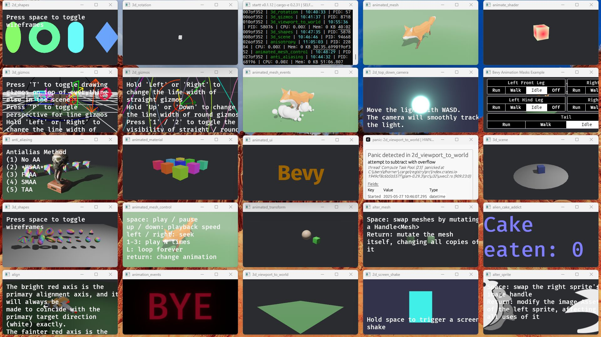

# cargo-e_walkthrus
cargo-e example walkthru scripts and media

[nu-ansi-term](https://github.com/nushell/nu-ansi-term)
```
cargo e -W 3
```


[bevy/c630a](https://github.com/bevyengine/bevy) [cargo-e/0.2.29](https://crates.io/crates/cargo-e/0.2.29) [startt/0.1.5](https://crates.io/crates/startt/0.1.5)
```
startt -f -g1x4 cargo-e --run-all --run-at-a-time 4
```

- https://www.youtube.com/watch?v=cFZnU7iLL44


```
startt --follow --grid 5x5m1 --fit-grid --timeout 5 --hide-title-bar --flash-topmost --shake-duration 50 --hide-taskbar --hide-border -rpf -rpc --assign-parent-cell 0x2 --keep-open cargo-e -f --run-all --run-at-a-time 27
```

- includes one graphical panic from cargo-e.